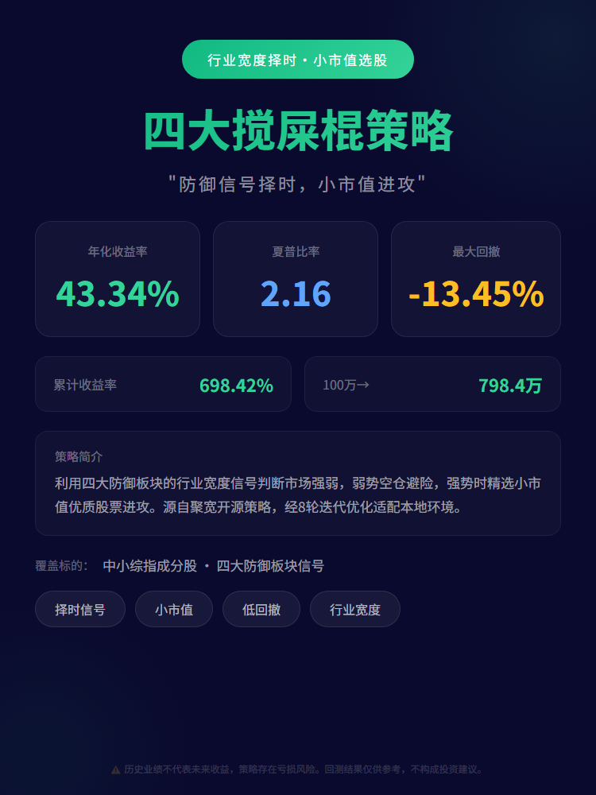
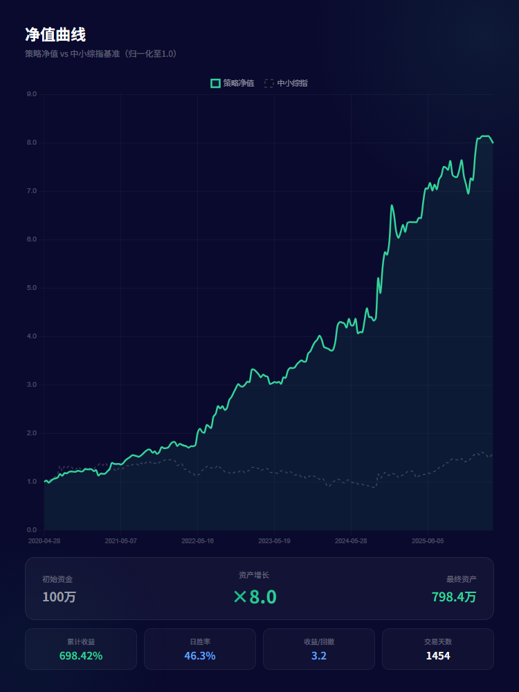
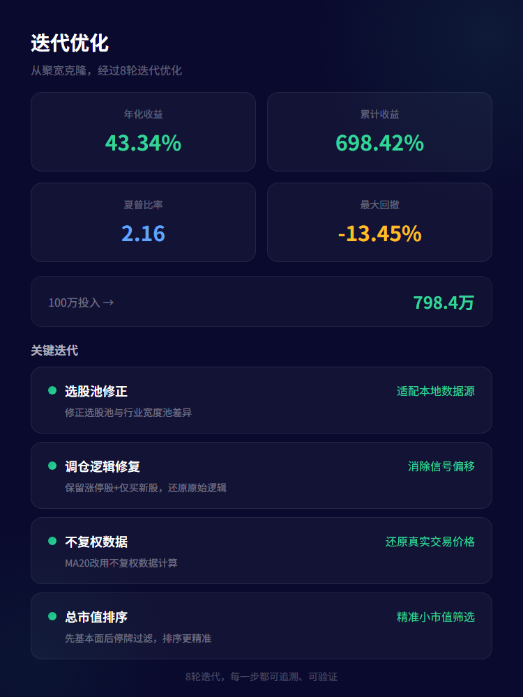
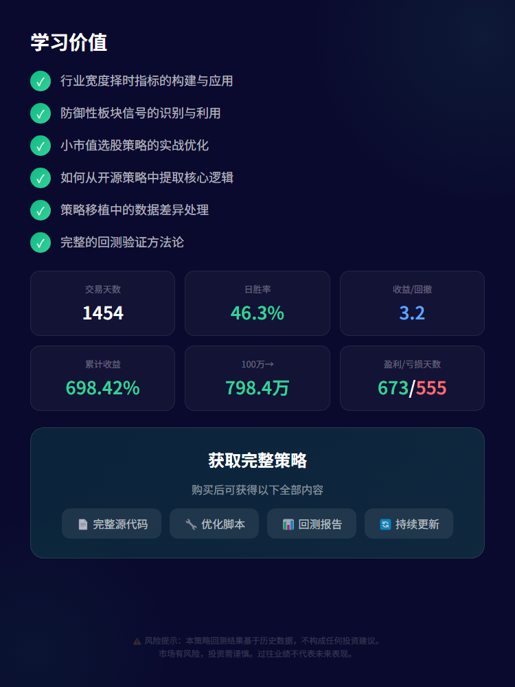

# VIP 量化策略集

> 精选量化策略案例，每一套都经过系统性优化与回测验证。 不卖神话，只交付方法论——学思路、学框架、学优化，真正可复用的量化能力。

---

## 策略总览

| 策略 | 年化收益 | 夏普比率 | 最大回撤 | 回测区间 | 策略风格 |
|:----:|:-------:|:-------:|:-------:|:-------:|:-------:|
| ETF轮动策略 | **50.02%** | **2.21** | -12.65% | 2020 ~ 2026 | 动量轮动·攻守切换 |
| 四大搅屎棍策略 | **43.34%** | **2.16** | -13.45% | 2020 ~ 2026 | 行业宽度择时·小市值选股 |
| 高股息行业均仓策略 | **23.23%** | **1.32** | -15.04% | 2020 ~ 2026 | 基本面选股·稳健复利 |
| 高低波动ETF轮动策略 | **38.92%** | **1.87** | -18.00% | 2022 ~ 2026 | 波动率驱动·攻守兼备 |

---

## ETF轮动策略

> **只骑最强的马，没马就下马**

从多类 ETF 中自动识别当前最强品种，集中持仓；当市场整体走弱时自动清仓观望。

- **策略风格**：动量轮动 · 攻守切换
- **标的覆盖**：创业板 · 纳指 · 黄金 · 国债
- **回测验证**：5.8 年回测，5 轮优化（43 项方案，采纳 3 项）

| 核心指标 | 表现 |
|:-------:|:----:|
| 年化收益率 | 50.02% |
| 夏普比率 | 2.21 |
| 最大回撤 | -12.65% |
| 总收益率 | 938.50% |

  
  

  
  

**你将学到：**

- 如何构建多品种轮动框架
- 如何设计风控规则避免追高和频繁换仓
- 如何系统性优化策略参数（5 轮优化全过程可复现）
- 理解优化组合中的参数冲突与协同效应
- 获取完整的优化数据，透明可验证
- 学习过拟合风险评估与一致性验证方法

---

## 四大搅屎棍策略

> **防御信号择时，小市值进攻**

利用四大防御板块的行业宽度信号判断市场强弱，弱势空仓避险，强势时精选小市值优质股票进攻。

- **策略风格**：行业宽度择时 · 小市值选股
- **标的覆盖**：中小综指成分股 · 四大防御板块信号
- **回测验证**：5.8 年回测，8 轮迭代优化

| 核心指标 | 表现 |
|:-------:|:----:|
| 年化收益率 | 43.34% |
| 夏普比率 | 2.16 |
| 最大回撤 | -13.45% |
| 总收益率 | 698.42% |

  
  

  
  

**你将学到：**

- 行业宽度择时指标的构建与应用
- 防御性板块信号的识别与利用
- 小市值选股策略的实战优化
- 如何从开源策略中提取核心逻辑
- 策略移植中的数据差异处理
- 完整的回测验证方法论

---

## 高股息行业均仓策略

> **精选优质分红，稳健复利增长**

选择现金流健康、分红可持续、净利润稳定增长的公司，通过行业分散配置构建低波动稳健收益组合。

- **策略风格**：基本面选股 · 稳健复利
- **标的覆盖**：全市场高股息标的
- **回测验证**：5.8 年回测，基本面过滤 + 行业分散

| 核心指标 | 表现 |
|:-------:|:----:|
| 年化收益率 | 23.23% |
| 夏普比率 | 1.32 |
| 最大回撤 | -15.04% |
| 总收益率 | 233.70% |

  
  

  
  

**你将学到：**

- 高股息陷阱的识别与规避
- 如何筛选分红可持续的优质公司
- 分散配置的实战思路
- 稳健股息率的评估方法（多年均值消除异常干扰）
- 低波动策略的设计哲学（回撤仅 15%）
- 完整的回测框架与参数优化方法论

---

## 高低波动ETF轮动策略

> **VIX 信号驱动，攻守兼备**

基于隐含波动率信号，在高弹性 ETF 与低波动标的之间动态切换持仓——市场恐慌时转入避险，情绪恢复时转回进攻。

- **策略风格**：波动率驱动 · 攻守兼备
- **标的覆盖**：高波动标的中证 500 · 低波动标的农业银行
- **回测验证**：3.4 年回测，44 种信号组合测试

| 核心指标 | 表现 |
|:-------:|:----:|
| 年化收益率 | 38.92% |
| 夏普比率 | 1.87 |
| 最大回撤 | -18.00% |
| 总收益率 | 205.47% |

  
  

  
  

**你将学到：**

- 波动率信号在实战中的应用方法
- 多信号确认机制的设计思路
- 信号源与交易标的解耦设计
- 高波动与低波动标的的选择方法
- 如何利用波动率信号控制风险
- A股 T+1 规则下的策略设计

---

## 获取方式

本目录下的策略为付费学习内容，购买后可获得：

- ✅ 完整策略源代码
- ✅ 优化参数配置与优化脚本
- ✅ 回测报告与优化数据
- ✅ 后续策略更新

如有需要学习，请联系作者购买：

---

> ⚠️ **风险提示**：本内容仅供学习量化策略开发方法，历史回测不代表未来收益，任何量化策略都存在亏损风险，请根据自身风险承受能力谨慎决策。
